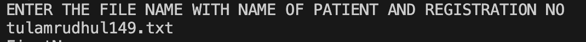
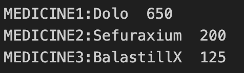

# ICS_CP_CodeTitans

## Team members
```
1. Aman Jain B23CH1002
2. Mrudhul Tula B23EE1076
3. Vaibhav Singh B23CI1043
4. Vansh Tomar B23PH1027
```

## How to execute your code
###### Step 1:Download VS code
###### Step 2:If you are windows user download a gcc compiler.
###### Step 3:Download the code and run it in VS code.
###### Step 4:Input the suitable data according to the instruction appearing on the terminal.


# Environment setup

Code dependencies
1.Patients: https://github.com/aman2810-jsr/ICS_CP_CodeTitans/tree/5cb5407a3d5a0672575d1abc58a799828bbde4f2/patients

2.Doctors: https://github.com/aman2810-jsr/ICS_CP_CodeTitans/tree/45c7b0f5d01deff2549c479faeeb5719b67656b1/doctors

## Execution guidelines
-->Enter the data as per the given commands displayed on the terminal.

-->Enter the file name with no space between the firsta and last name and the reg. number and add ".txt" at the end.

-->For finding about the doctor and the patient just write the name.

-->Enter the BP results as upper BP and lower BP with a space betwen them.

-->Enter the name of the test and the inpatient and outpatient status in uppercae.

-->If  prescribed medicine is less than 5 then enter NA.

## FORMAT EXECUTION
--> Enter The Purpose of Visit:
```c
char reason_of_visit[20];
  printf("visit or registration:\n");
  scanf("%s",reason_of_visit);
```


-->If the purpose of visit is enquiry then entry the name of the doctor whom you want to enquire about and if the purpose of visit is registration then enter the personal details of the patient.
```c
void search()
  {
    printf("ENTER THE NAME OF DOCTOR (OR) PATIENT WITH REGISTRATION NO:");
    FILE* fp1;
    char s[100],S[]=".txt";
    scanf("%s",s);
    strcat(s,S);
    fp1=fopen(s,"r");
    int c;
    while ((c = fgetc(fp1)) != EOF) 
    {
        putchar(c);
    }
  }
```

-->Enter the name of the doctor to visit then enter the result of the general tests.
EX:
```c
  printf("Enter the Height of patient: \n");
  scanf("%f",&height);
  fprintf(fp,"\nHEIGHT:%.2f",height);
```
-->Enter test name as prescribed by the doctor.
```c
    char test1[40],test2[40],test3[40];
    printf("TEST1:");
    scanf("%s",test1);
    printf("TEST2:");
    scanf("%s",test2);
     printf("TEST3:");
    scanf("%s",test3);
```
-->Enter the result of the tests.
```c
void NS1()
  {
    printf("ENTER THE RESULT OF THE NS1 TEST");
    float r;
    scanf("%f",&r);
    fputs("\nTEST NAME\t\tRESULTS\t\tREFERENCE INTERVAL",fp);
    fprintf(fp,"\nDENGUE NS1\t\t%.2f\t\t<0.90",r);
  }
```

-->Enter the inpatient outpatient status as suggested by the doctor.
```c
printf("\nIN PATIENT OR OUT PATIENT");
char inout[50];
scanf("%s",inout);
```
-->If inpatient then enter the discharge date of the patient.
```c
if(strcmp(I,inout)==0)
{
 fputs("\t\t IN PATIENT",fp2);
  printf("Discharge date:");
  int date,month,year;
  scanf("%d %d %d",&date,&month,&year);
  fprintf(fp2,"%d/%d/%d\n",date,month,year);
}
```
-->Enter the medicine with the dosage as suggessted by the doctor.
```c
char m1[20],m2[20],m3[20],m4[20],m5[20];
int dos1,dos2,dos3,dos4,dos5;
printf("Enter Medicine1:");
scanf("%s",m1);
printf("Enter Dosage1:");
scanf("%d",&dos1);
```



